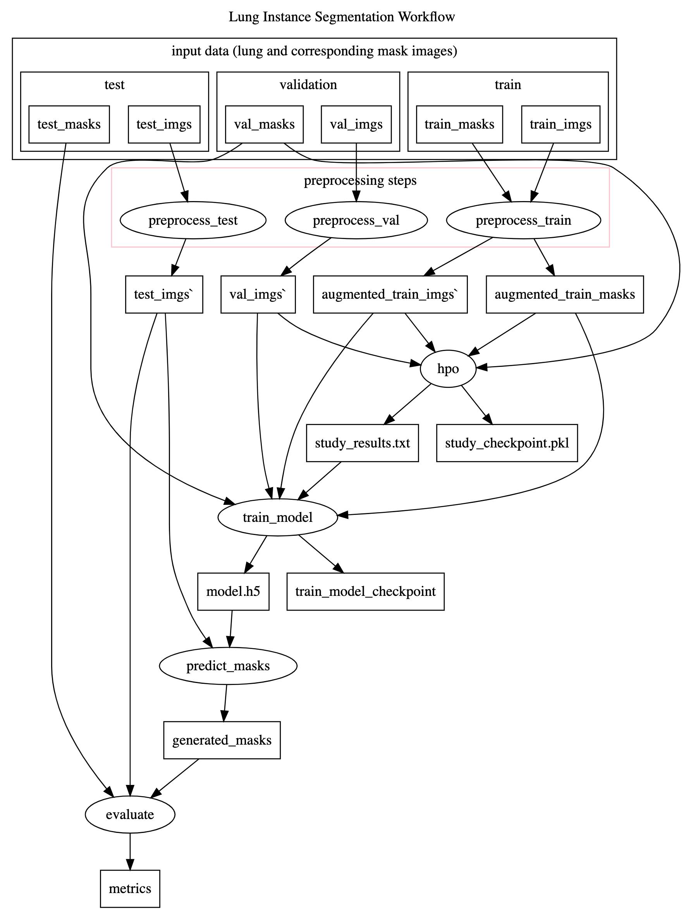

# Lung-Instance-Segmentation-Workflow 
(Instance segmentation with U-Net/Mask R-CNN workflow using Keras &amp; Ray Tune)

Lung instance segmentation workflow uses [Chest X-ray](https://www.ncbi.nlm.nih.gov/pmc/articles/PMC4256233/) for predicting lung masks from the images using [U-Net](https://arxiv.org/abs/1505.04597) model. 

## Running the Workflow

1. Clone the repo: `git clone https://github.com/pegasus-isi/lung-instance-segmentation-workflow.git`
2. Run using the sample dataset: `python3 workflow.py --lung-img-dir inputs/train_images --lung-mask-img-dir inputs/train_masks`

To Run the workflow using the production dataset, you must first obtain it.
1. Install the Kaggle Python package: `pip3 install kaggle`
2. Download the dataset: `python3 get-dataset.py`
3. Run `python3 workflow.py`
    - by default the script will look for data in `./data` which was created by `get-dataset.py`

## Executing Standalone Scripts

1. Use the command `pip3 -r requirements.txt` to install the required packages
2. Go back to the `lung-instance-segmentation-workflow` directory and make a directory called `output`
3. Download the dataset by running the python script called "get-dataset.py" by `python get-datatset.py`
4. Execute the `end-to-end.sh` script
